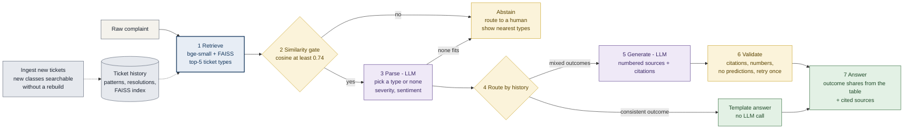

# Support Ticket Resolution Assistant


A semantic resolution assistant for a support desk. An agent pastes a raw customer complaint and gets back:

1. **Triage**: category, product, severity and customer sentiment.
2. **Grounded guidance**: how similar past tickets were really resolved (shares of each outcome, typical close time), and
   step-by-step advice for the agent where **every statement cites the ticket history it came from**.
3. **Evolving data**: new closed tickets and brand-new ticket classes are ingested without a rebuild.

Built for Prodapt's *Use Case 2: Intelligent Support Ticket Resolution Assistant*.

**About the data.** The provided sample (25,921 rows, 7 complaint types, templated resolutions) was too thin for a real
retrieval system ([`EDA/`](EDA/)). We used the official NYC 311 export, the same source with more columns, as the corpus:
94,674 closed tickets (2026-03-01 to 03-09). It is city-services data, not telecom. The engine is domain-agnostic: the
evolution demo asks a telecom complaint, abstains, ingests a (clearly synthetic) *Broadband Service* class in seconds, and then
answers it with cited telecom resolutions.

*Why real data and not a synthetic corpus?* On purpose. Synthetic tickets are easy for a model to separate; real tickets carry
the natural noise that makes retrieval hard (91% of ticket volume has mixed outcomes, and sibling categories overlap). The ticket
history and resolutions here are real. The only synthetic text is **customer-style complaints**, used as a proxy because the corpus
has no customer prose, and checked against 33,773 real later tickets (see *Checkpoints, evals and monitoring*).

## Live demo
https://github.com/user-attachments/assets/bb1e64f7-66a0-4f0b-a10f-5a53260f6439
> **VIDEO_LINK:** `[Watch the demo (about 90 seconds)](PASTE_LINK_HERE)`

> **Screenshot placeholder 1 (hero GIF, under 5 MB):** paste the heating complaint, the triage strip and cited steps appear, click a citation chip and its source highlights. Save as `docs/img/hero.gif`.

## Architecture



<sub>Blue: retrieval. Purple: LLM calls. Amber: guardrails and routing. Green: outputs. Grey: data. More diagrams (request sequence, ingestion, deployment): [`docs/architecture.md`](docs/architecture.md).</sub>

**Results at a glance**

| | |
|---|---|
| Corpus | 94,674 real closed tickets, collapsed into 1,266 ticket patterns |
| Grounding (independent judge model) | 94.2% of claims supported by the cited sources, 1.7% unsupported |
| Real-data check (33,773 later tickets) | History gives the true outcome probability **0.315** vs **0.040** for a global guess |
| Evolving data | 33,773 real tickets ingested, 8 of 8 checks, 132 new ticket classes searchable without a rebuild |
| Cost and speed | About $0.0005 and 4 to 5 s per answered request; abstentions are free |
| Engineering | 48 tests, 84% coverage, five-stage CI, deployed and verified on Kubernetes |

---

## 1. Problem background understanding

- **The provided sample could not justify RAG.** 25,921 rows, 7 complaint types, and only 2 to 3 templated resolutions per descriptor: a lookup table reproduces most of it.
- **The real export changes the picture.** 94,674 closed tickets form 1,266 patterns; for **91% of ticket volume the same pattern ends in several different resolutions**, so a fixed lookup would be wrong most of the time.
- **Only 4% of volume is predictable.** 19 patterns (4.3% of tickets) have a consistent outcome (at least 90% over at least 30 tickets), so they take a cheap template path; everything else needs retrieval.
- **Data quality was checked, not assumed.** 3.2% of resolution texts were double-encoded and about 3% are cut off at 500 characters in the source; both are handled and flagged.

> **Screenshot placeholder 2 (EDA):** the resolution-diversity chart or table from the EDA notebook. Save as `docs/img/eda.png`.

[Details: problem background and EDA results](docs/rubric/01_problem_background.md)

## 2. Solution depth and production scale

- **A complete service, not a notebook.** Stateless FastAPI (`/ask`, `/ingest`, `/ready`, `/metrics`), a hand-written UI, graceful degradation if the LLM fails, and an API key on the endpoints that cost money.
- **Deployed and verified on Azure Kubernetes Service.** Probes, resource limits, autoscaler, private registry, non-root read-only container, an authenticated request answered.
- **Five-stage CI/CD.** Quality, security, test, build and verify, publish: ruff, hadolint, kubeconform, gitleaks, bandit, Trivy, a retrieval gate with the real embedder, and a container smoke test.
- **Measured, not guessed.** 4 to 5 s and about $0.0005 per answer, a capacity model, and a written scaling path for what breaks first (the in-process index, ingestion, baked-in state).

> **Screenshot placeholder 3 (pipeline):** the GitHub Actions run with all five stages green. Save as `docs/img/ci.png`.
> **Screenshot placeholder 4 (Kubernetes):** `kubectl get pods,svc,hpa,deploy` showing `1/1 Running` and the autoscaler. Save as `docs/img/aks.png`.

[Details: production scale, topology, cost model, alerts](docs/rubric/02_solution_and_scale.md)

## 3. Design decisions (each one backed by an experiment)

| Decision | Alternative tried | Measured result | Chosen |
|---|---|---|---|
| Index ticket **patterns**, enriched with LLM-written example complaints | Labels only | Category accuracy **67.6% to 76.0%**, recall@5 65.8% to 73.2% (A1) | Patterns + examples |
| Embedder | bge-m3 (60x slower to build) | Same accuracy (76.0% vs 76.8% category) (A2) | bge-small |
| Rank by similarity alone | Boost popular patterns | Every boost lowered accuracy (A3) | No popularity prior |
| Let the LLM **pick** among the top-5 candidates | Trust nearest neighbour | Category 75.7% to **83.1%**, exact pattern 42.8% to **57.2%** (A5) | LLM selection |
| **Facts from code, prose from the LLM** | LLM writes everything | Fully supported answers **28% to 73%**, latency 7.1 s to 4.2 s (A8) | Outcomes rendered by code |
| Hard **validator**: citations, numbers, no predictions | Prompt rules only | Unsupported claims 2.4% to 1.7%, fully supported answers 72.6% to 76.7% (A9) | Validate and retry |
| **Abstain** (similarity gate plus LLM "none") | Always answer | A threshold of 0.74 keeps 97.6% of valid queries and rejects 76% of off-topic ones (A4) | Two gates |
| **Route by history** (template vs full RAG) | RAG for everything | Real later tickets: `fast_lookup` realised 93.5% vs 96.4% predicted | Tiered |

> **Screenshot placeholder 5 (ablations):** the ablation table or a bar chart of the retrieval results. Save as `docs/img/ablations.png`.

[Details: all nine ablations with setup, numbers and reasoning](docs/ablations.md) · [Rubric summary](docs/rubric/03_design_decisions.md)

## 4. Code

- **Clean seams.** Retrieval, parsing, generation, validation, ingestion and API are separate modules; the vector store sits behind an interface so a production database is a swap, not a rewrite.
- **48 tests, 84% coverage, no secrets needed.** A stub LLM and a fake embedder test the validator, tier routing, ingestion, abstention, degraded mode and the API contract.
- **Quality gates in CI.** Lint with a pinned rule set, static security analysis, secret scanning, manifest and Dockerfile validation, and a Trivy image scan.
- **Reproducible.** A ready-to-run state is committed in [`artifacts/`](artifacts/); `scripts/fetch_data.py` rebuilds everything from the NYC source.

<details>
<summary>Tools used and why</summary>

| Area | Tools | Why |
|---|---|---|
| Data | pandas, pyarrow, Socrata API | Cleaning, parquet state, reproducible download |
| Retrieval | sentence-transformers (bge-small), FAISS | Local embeddings, exact vector search |
| LLM | OpenAI structured outputs, Pydantic | Schema-constrained parsing and generation |
| Service | FastAPI, Prometheus client, vanilla JS + CSS | Stateless API, metrics, no-build UI with a strict CSP |
| Quality | pytest, ruff, bandit, gitleaks | Tests, lint, security |
| Packaging and deploy | Docker, Compose, Kubernetes, AKS, ACR | Container, orchestration, cloud |
| CI/CD | GitHub Actions, Trivy, hadolint, kubeconform, Dependabot | Build, scan and publish pipeline |
| Analysis | Jupyter, nbconvert, Mermaid | EDA, ingestion check, diagrams |

</details>

[Details: code structure, tests and quality gates](docs/rubric/04_code.md)

## 5. Checkpoints, evals and monitoring

- **Evals at every stage.** Retrieval, parsing and generation each have an eval; faithfulness is judged by a **different model** than the generator; every change has a logged ablation, including negative results.
- **A real-data backtest.** On 33,773 real tickets from after the training window, the pattern history gives the true outcome 0.315 probability vs 0.040 for a global guess.
- **Checkpoints you can roll back to.** Index metadata, a per-batch ingestion audit log, committed eval reports, resumable jobs, and an immutable versioned state image with one-command rollback.
- **Monitoring built in.** `/metrics` exposes abstain rate, tier mix, latency per stage, tokens and the similarity distribution (the drift signal), with written alert rules; logs carry a request ID and never the complaint text.

> **Screenshot placeholder 6 (evals):** the real-ticket backtest result or the `/metrics` page. Save as `docs/img/evals.png`.

[Details: evals, backtest, checkpoints and alert rules](docs/rubric/05_evals_and_monitoring.md) · [Evolving-data study](docs/evolving_data.md)

---

## Limitations (stated up front)

- City-services corpus, not telecom; telecom is shown with a synthetic class only.
- No separate knowledge base: the agencies' standard resolution texts play that role.
- Retrieval accuracy is measured on LLM-written complaints; the real-ticket backtest is the real-data check. Severity and sentiment are LLM judgements, not validated against human labels.
- Exact-pattern accuracy tops out near 57%: outcomes are genuinely mixed, so the system shows the distribution instead of predicting one.
- About 30% of clearly out-of-scope private-company complaints still match a 311 consumer category.

## Quickstart

A ready-to-run state is committed, so nothing has to be built. You need an OpenAI key only to answer.

```bash
echo OPENAI_API_KEY=sk-... > .env
docker compose up --build
```

Open <http://localhost:8000/> (UI) or <http://localhost:8000/docs> (API).

<details>
<summary>Without Docker, tests, and rebuilding from the source data</summary>

```bash
python -m venv .venv                      # Windows: .venv\Scripts\activate    macOS/Linux: source .venv/bin/activate
pip install -r requirements-dev.txt
pip install -e .
python -m uvicorn ticketrag.api:app --port 8000
python scripts/ask.py "No heat in my apartment for 3 days and I have a baby"
pytest -q                                  # no key and no downloads needed (stub LLM)

# rebuild everything from the official source
python scripts/fetch_data.py --start 2026-03-01 --end 2026-03-10 --out dataset/closed_tickets_rag.csv
python scripts/build_patterns.py
python scripts/build_index.py
python scripts/run_eval.py --tag mine
```

How to give input and read the output: [`docs/testing_guide.md`](docs/testing_guide.md).

</details>

## Repository layout

```
src/ticketrag/   patterns, retrieve, store, parse, generate (+validator), judge, pipeline, ingest, api, static UI
scripts/         data fetch, index build, ingestion, evals, ablation table, demos
tests/           stub LLM + fake embedder; unit, ingestion, pipeline and API tests
artifacts/       committed ready-to-run state and generated example complaints
eval/            reports (JSON) and out-of-domain query sets
docs/            architecture, how it works, ablations, evolving data, production scale, rubric pages
deploy/          Kubernetes manifests, AKS deploy script
.github/         five-stage CI/CD workflow, Dependabot
EDA/             notebooks: dataset selection and next-days ingestion check
```
