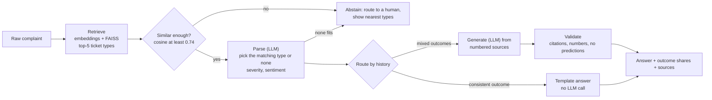

# Support Ticket Resolution Assistant


A semantic resolution assistant for a support desk. An agent pastes a raw customer complaint and gets back:

1. **Triage**: category, product, severity and customer sentiment.
2. **Grounded guidance**: how similar past tickets were really resolved (shares of each outcome, typical close time), and
   step-by-step advice for the agent where **every statement cites the ticket history it came from**.
3. **Evolving data**: new closed tickets and brand-new ticket classes are ingested without a rebuild.

Built for Prodapt's *Use Case 2: Intelligent Support Ticket Resolution Assistant*.

> **About the data.** The provided sample (25,921 rows, 7 complaint types, templated resolutions) was too thin for a
> real retrieval system (`EDA/`). We used the official NYC 311 export, the same source with more columns, as the corpus:
> 94,674 closed tickets (2026-03-01 to 03-09). It is city-services data, not telecom. The engine is domain-agnostic: the
> evolution demo asks a telecom complaint, abstains, ingests a (clearly synthetic) *Broadband Service* class in seconds,
> and then answers it with cited telecom resolutions.

## How it works (one minute)



Key ideas (details in [`docs/how_it_works.md`](docs/how_it_works.md)):

- **Index ticket types, not tickets.** 94k tickets collapse into 1,266 patterns (`complaint_type / descriptor /
  descriptor_2`); each pattern holds the distribution of its recorded resolutions. The corpus has labels but no customer
  prose, so each pattern is also embedded through LLM-written example complaints.
- **Facts come from code, language from the LLM.** Outcome shares, counts and close times are computed from the table;
  the LLM only writes a short summary and steps and may cite only numbered sources. A validator rejects uncited claims,
  invented numbers and predictions ("will ...").
- **Several ways to say "I don't know":** a similarity threshold, an LLM "none of these", borderline and low-evidence
  warnings, and a statistics-only fallback if the LLM is unavailable.

## Results

All numbers are reproducible from `eval/reports/`; every design decision and its evidence is in
[`docs/ablations.md`](docs/ablations.md).

| Question | Result |
|---|---|
| Do LLM-written example complaints help retrieval? | Category accuracy 67.6% to 76.0%, recall@5 65.8% to 73.2% (A1) |
| Is a bigger embedder worth it? | bge-m3 gave no gain for 60x the build time, so bge-small (A2) |
| Does LLM selection beat nearest-neighbour? | Category 75.7% to 83.1%, exact pattern 42.8% to 57.2% (A5) |
| Are generated answers grounded? (separate judge model) | 94.2% of claims supported, 1.7% unsupported, 76.7% of answers fully supported (A9) |
| Does history predict **real** future outcomes? (33,773 real later tickets) | Probability given to the true resolution 0.315 vs 0.040 for a global guess; `fast_lookup` realised 93.5% vs 96.4% predicted ([`docs/evolving_data.md`](docs/evolving_data.md)) |
| Can new data and classes be ingested? | 33,773 real tickets, 8/8 checks, idempotent, 132 new patterns searchable without a rebuild |
| Cost and speed | About $0.0005 and 4 to 5 s per answered request; abstentions cost nothing |

## Quickstart

Needs an OpenAI key only to *answer* (`OPENAI_API_KEY` in a `.env` file). A ready-to-run state is committed in
[`artifacts/`](artifacts/), so nothing has to be built first.

**Docker (recommended)**

```bash
echo OPENAI_API_KEY=sk-... > .env
docker compose up --build
```

Open <http://localhost:8000/> (UI) or <http://localhost:8000/docs> (API).

**Python**

```bash
python -m venv .venv
# Windows: .venv\Scripts\activate      macOS/Linux: source .venv/bin/activate
pip install -r requirements-dev.txt
pip install -e .
python -m uvicorn ticketrag.api:app --port 8000          # then open http://localhost:8000/
python scripts/ask.py "No heat in my apartment for 3 days and I have a baby"   # or use the CLI
pytest -q                                                 # tests need no key and no downloads (stub LLM)
```

How to give input and read the output: [`docs/testing_guide.md`](docs/testing_guide.md).

**Rebuild everything from the source data**

```bash
python scripts/fetch_data.py --start 2026-03-01 --end 2026-03-10 --out dataset/closed_tickets_rag.csv
python scripts/build_patterns.py        # tickets -> pattern table, resolutions, tiers
python scripts/build_index.py           # embeddings + FAISS (uses the committed example complaints)
python scripts/run_eval.py --tag mine   # retrieval eval; other evals: eval_parse.py, eval_generation.py, backtest_temporal.py
```

`scripts/expand_patterns.py` regenerates the example complaints with the LLM (about $0.20).

## API

| Endpoint | Purpose |
|---|---|
| `POST /ask` | Complaint in, triage + cited answer out |
| `POST /ingest`, `POST /reload` | Add newly closed tickets (hot reload); disabled when `TICKETRAG_IMMUTABLE=1` |
| `GET /health`, `/ready` | Liveness and readiness (index loaded) |
| `GET /metrics` | Prometheus: abstain rate, tier mix, latency per stage, tokens, similarity distribution |

Set `TICKETRAG_API_KEY` to require an `X-API-Key` header on `/ask`, `/ingest` and `/reload`.

## Production

Verified on Azure Kubernetes Service (probes, limits, autoscaler, private registry, authenticated request answered):
[`docs/production_scale.md`](docs/production_scale.md) covers topology, scaling limits and fixes, a measured cost model,
alert rules and a security checklist. Manifests are in [`deploy/`](deploy/); CI (lint, tests, retrieval gate,
container smoke test, image publish) is in [`.github/workflows/ci.yml`](.github/workflows/ci.yml).

## Repository layout

```
src/ticketrag/   patterns, retrieve, store (FAISS), parse, generate (+validator), judge, pipeline, ingest, api, static UI
scripts/         data fetch, index build, ingestion, evals, ablation table, demos
tests/           stub LLM + fake embedder; unit, ingestion, pipeline and API tests
artifacts/       committed ready-to-run state (patterns, FAISS index) and generated example complaints
eval/            reports (JSON) and out-of-domain query sets
docs/            architecture, how it works, ablations, evolving data, production scale, testing guide
deploy/          Kubernetes manifests, AKS deploy script
EDA/             notebooks: dataset selection and next-days ingestion check
```

## Limitations (stated up front)

- City-services corpus, not telecom; telecom is shown with a synthetic class only.
- No separate knowledge base: agency resolution templates play that role.
- Most quality numbers use LLM-written complaints because the corpus has no customer text; the real-ticket backtest is the
  real-data check. Severity and sentiment are LLM judgements and are not validated against human labels.
- Exact-pattern accuracy tops out near 57% because sibling patterns are hard to separate and outcomes are genuinely mixed:
  the system shows the distribution of outcomes, it does not predict one.
- About 30% of clearly out-of-scope private-company complaints still match a 311 consumer category (documented in A8).
- Some resolution texts are cut off at 500 characters in the source data; they are flagged in the answer.
- Scaling beyond one node needs a shared vector store and a separate ingestion worker (see the production document).
