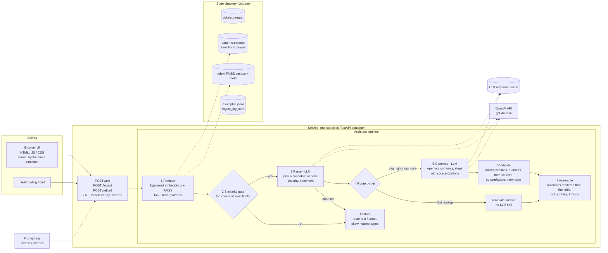
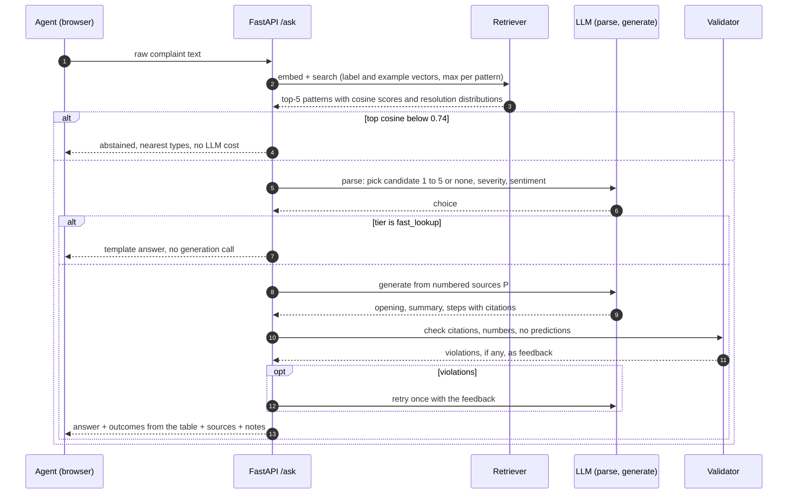
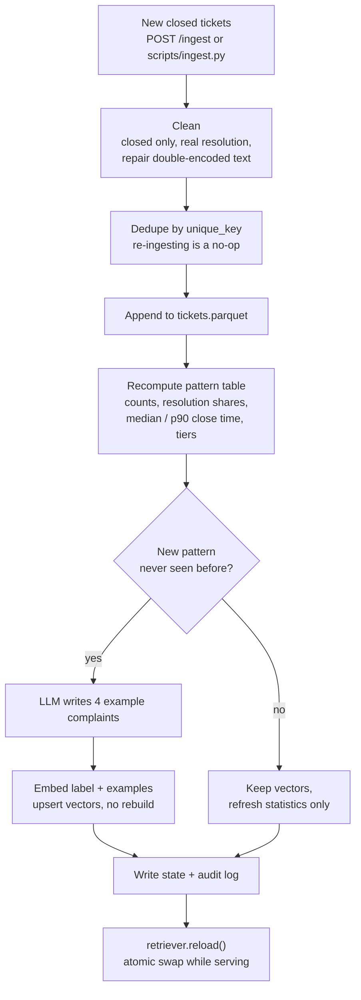
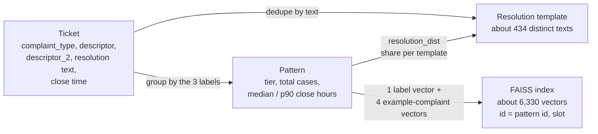
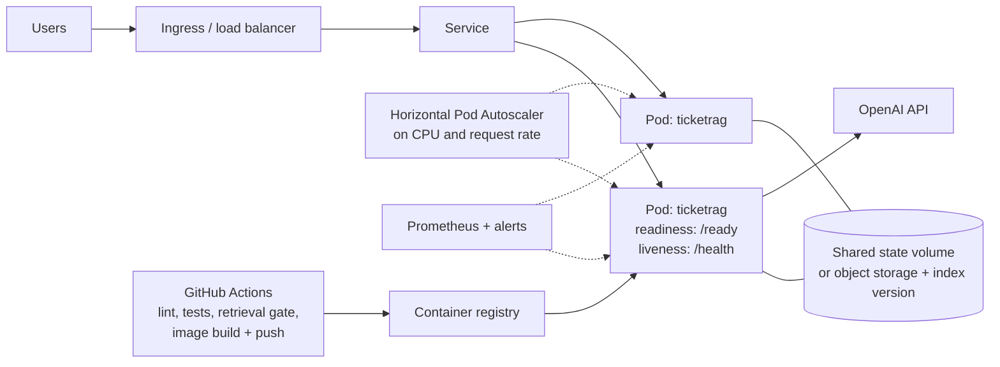

# Architecture

Diagrams are Mermaid (rendered natively by GitHub and VS Code). Numbers come from the evals in `docs/ablations.md`.

## 1. System overview

If the LLM path fails, `ask_safe` skips steps 3 to 6 and returns a statistics-only answer rendered from the retrieved table (`method = template_degraded`).

## 2. One request, in order

## 3. Evolving data: how new tickets and new classes get in

## 4. Data model in one picture

Tier rules (computed on every ingest): `fast_lookup` if the top resolution has at least 90% share and at least 30 tickets; `rag_light` if the top share is at least 50%; otherwise `rag_core`.

## 5. Deployment shape (target)

With a flat in-process index every replica loads its own copy, so ingestion must refresh all replicas (or move to a shared vector database). See the scale notes in `docs/how_it_works.md`.
